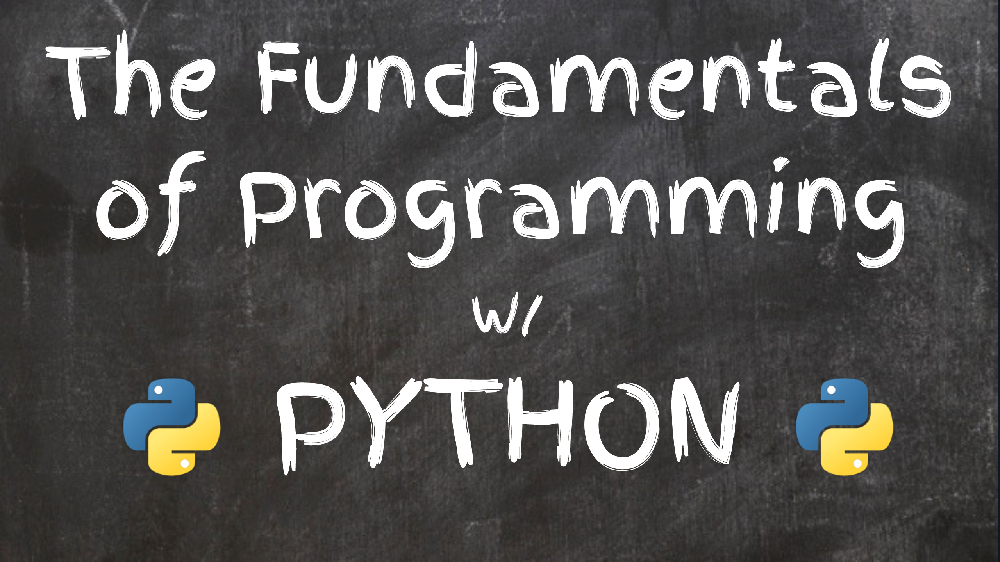

# Python Fundamentals

## Module Description

During this part of the program, we will focus on learning the basic fundamentals of the Python programming language. Python is a high-level interpreted language that has many benefits, including easy-to-read and easy-to-write syntax and powerful libraries that provide additional functionality. Even though Python is a great programming language for beginners, it is also used extensively for practical applications in engineering and data science. When you finish this course, you will be able to create Python programs for a variety of applications. We will cover concepts like **using variables**, **using data types and data structures**, **understanding conditionals and iteration**, and finally **defining custom python functions**.  

## Learning Outcomes

* Writing first python script and seeing outputs in the terminal
* Understanding, identifying and using python data types
* Understanding and demonstrating the creation of python data types
* Understanding how to access, update, add, and delete values within Python data
* Understanding how to define and use functions
* Understanding how to properly use each of the 5 python operator types (arithmetic, comparison, logical, membership, and conditional)
* Understanding and demonstrating how to use for loops/iteration
* Understanding how functions can help to improve code quality
* Understanding how to define functions both with parameters and without
* Describing the difference between parameters and arguments

## Assignment Schedule

All assignments are due by the start of your program session **(10am or 3pm)**  on the due date stated.

Assignment | Date Assigned | Due Date
---------- | ------------- | -------- 
**[Variables and Data Types](https://docs.google.com/document/d/1hgoP1zJ285bm4w2AGB4I2_3M65N0eFKJmf4Gr6VOpwg/edit?usp=sharing)** | October 19, 2021 | October 21, 2021
**[List and Dictionaries](https://docs.google.com/document/d/1mBAMCttdltl9-f7dTw0D_RFEnUlEet5j6apmyUyO7XI/edit?usp=sharing)** | October 20, 2021 | October 25, 2021
**[Functions, Looping, and Operators](https://docs.google.com/document/d/1ascyfxFCyyPjA9VTHIlto-Ziquq9Zhj8hM-b9j6HTAY/edit?usp=sharing)** | October 21, 2021 | October 26, 2021
**[The Classic Snake Game](https://docs.google.com/document/d/1y1lupKRTKi6RypGR_S7xDvjD1JNbs9_QMNm8gp3N39E/edit?usp=sharing)** | October 25, 2021 | October 27, 2021
**[Captain Rainbow's Checklist](https://docs.google.com/document/d/1j6QglX9jIp7WoE84mjZDPiSngCTb5yr9u2Hk7qG6h3w/edit?usp=sharing)** | October 27, 2021 | November 1, 2021

## Additional Resources

Any additional resources you may need (online books, etc ...) can be found here.

**[More on Python Data Types](https://www.geeksforgeeks.org/python-data-types/#Sequence)**

**[Understanding Python Booleans](https://www.digitalocean.com/community/tutorials/understanding-boolean-logic-in-python-3)**

**[String Class Methods](https://www.programiz.com/python-programming/methods/string)**

**[List Class Methods](https://www.programiz.com/python-programming/methods/list)**

**[Dictionary Class Methods](https://www.programiz.com/python-programming/methods/dictionary)**

**[TokyoEdTech's Youtube Channel](https://www.youtube.com/channel/UC2vm-0XX5RkWCXWwtBZGOXg)** ➾ Youtube channel outlining many interesting Python gaming tutorials

